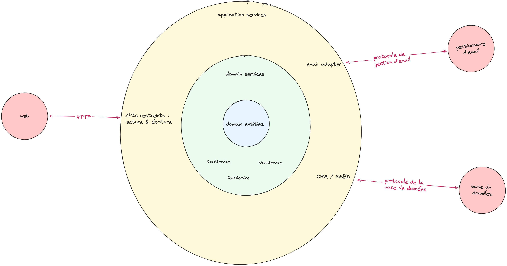
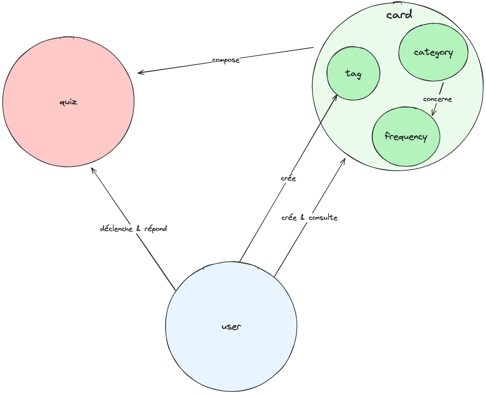

# Projet final

## Introduction
- **Classe** : ESGI 4AL2
- **Groupe 3** :
  - LAHMADI Zakarya
  - ZERGUINE Mohammed Mazene
  - ZHU Loïc

## Installation
### Installer le back-end
```
cd backend
npm install
npm run start
```

### Installer le front-end
```
cd frontend
npm install
npm run start
```
  
## Lancement
### Lancer le back-end :
- application :
  ```
  cd backend
  npm run start
  ```
- tests unitaires avec couverture de code :
  ```
  npm run test
  ```

- tests e2e playwright (branch bonus2)
  ```
  npx playwright install 
  npx playwright test
  ```
  
### Lancer le front-end :
- application :
  ```
  cd frontend
  npm run start
  ```
- tests unitaires avec couverture de code :
  ```
  npm run test:coverage
  ```

## Conception
### Schéma


### Schéma du front-end
[Structure du _front-end_](frontend/README.md#project-architecture)

### Domaine


## Fonctionnalites
- [ ] me connecter pour accéder à mes propres fiches
- [X] créer des fiches qui seront intégrées dans le système en catégorie 1
- [X] déclencher un questionnaire afin de répondre aux questions de mes fiches
- [X] faire qu’un questionnaire par jour
- [X] comparer une mauvaise réponse avec la réponse d’origine
- [X] forcer la validation d’une fiche même si ma réponse n’est pas la même
- [X] descente en catégorie 1 des fiches mal répondues
- [X] montée de catégorie des fiches bien répondues
- [X] les fiches de catégorie 7 bien répondues ne me sont plus proposées
- [X] les fiches proposées correspondent à la fréquence associée à leur catégorie du système de Leitner
- [X] mettre des tags personnalisés sur mes fiches
- [X] consulter toutes les fiches associées à un même tag et leur catégorie
- [ ] être notifié à l’heure de mon choix pour déclencher le questionnaire

## Bonus
- [ ] Bonus 1
- [X] Bonus 2 (regardez la branche bonus2)